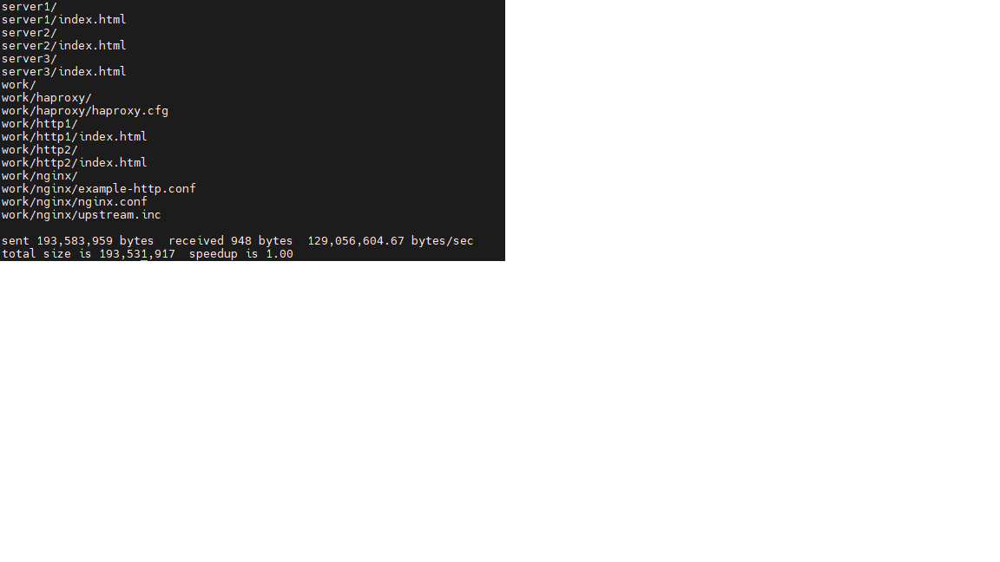
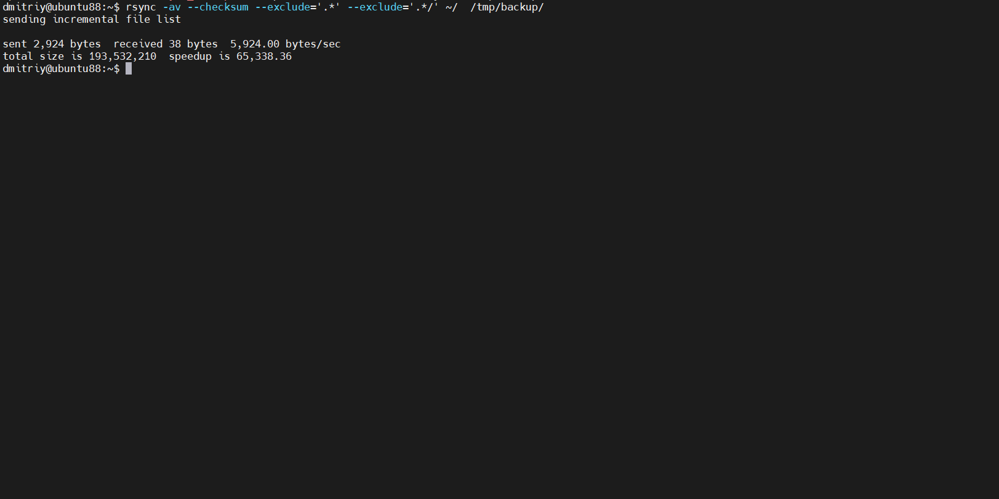
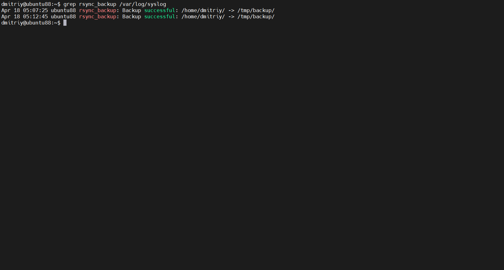

# Резервное копирование.

## Задание 1 — команда rsync

**Выполнение rsync (список файлов)**

**Продолжение rsync (список файлов)**

**Итог выполнения команды rsync**

## Задание 2 — скрипт и cron

**Скрипт backup.sh**

**Запуск скрипта + запись в syslog**

**Две записи Backup successful в syslog**

**crontab -l с задачей резервного копирования**

